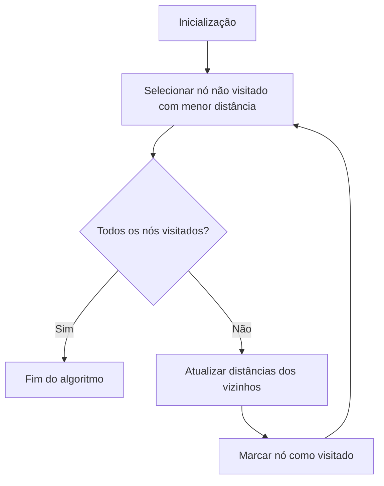
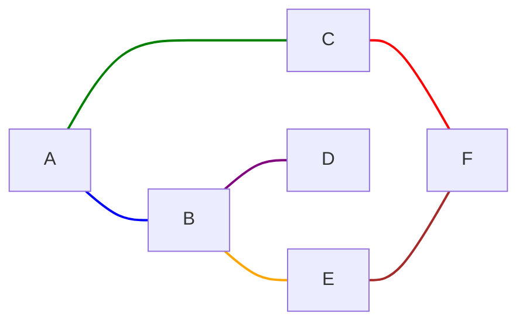
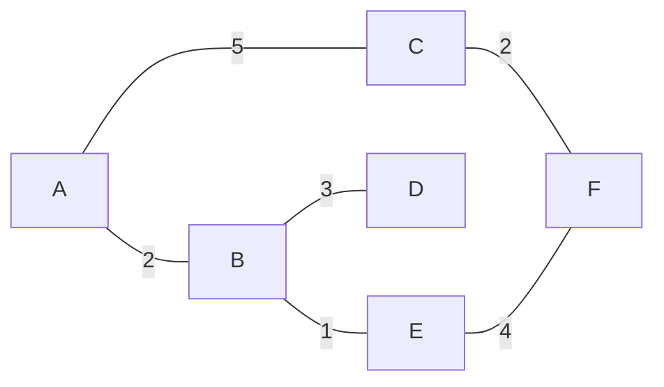
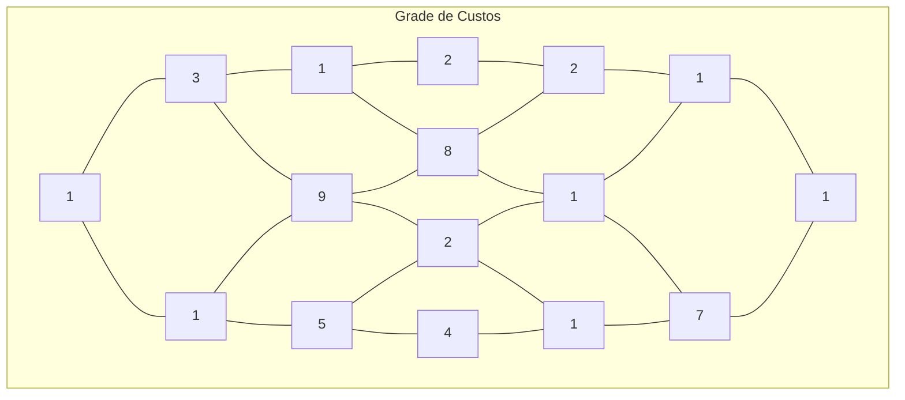
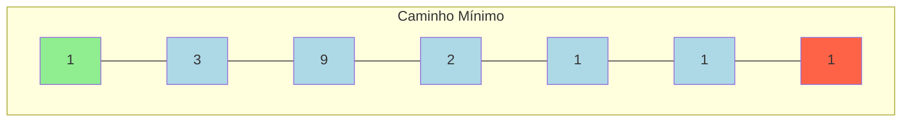
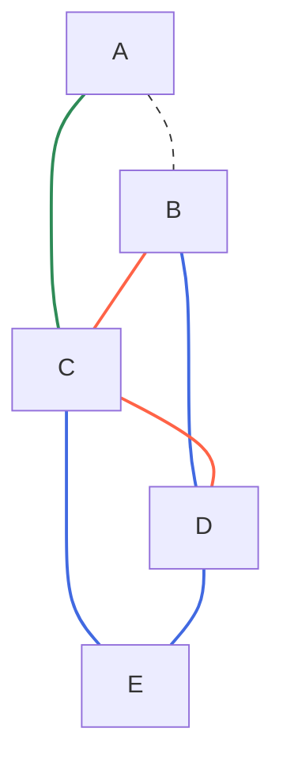
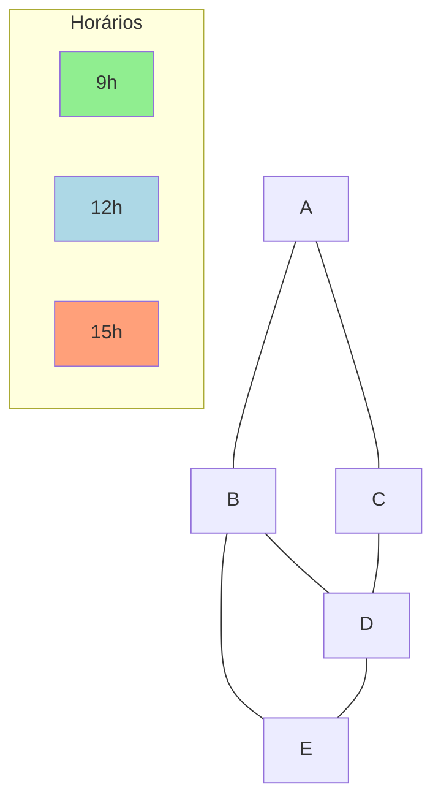
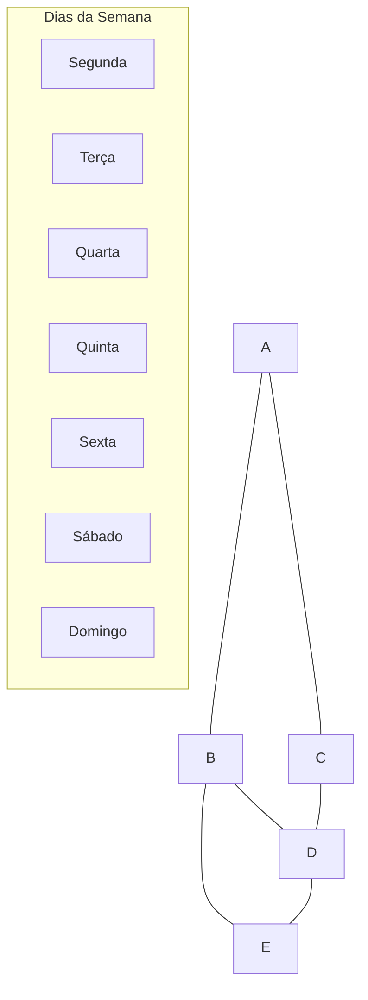
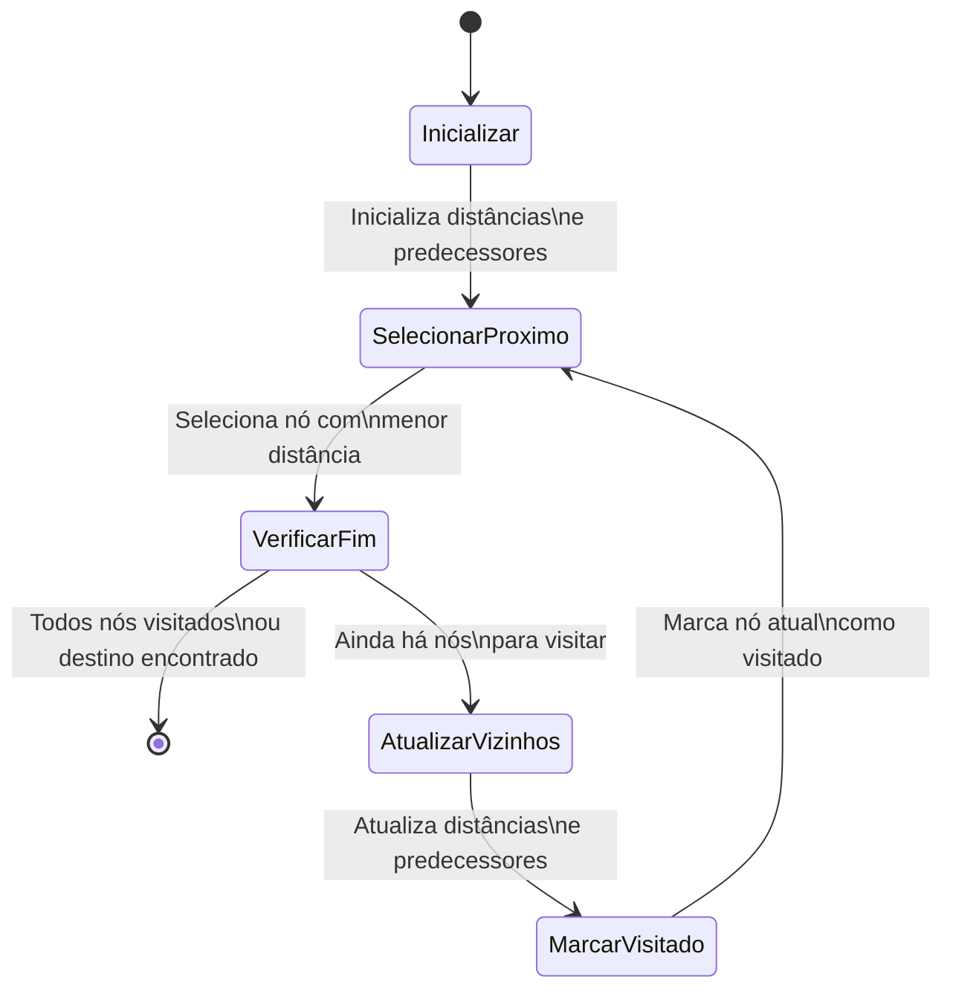

# Algoritmo de Dijkstra - Problemas e Implementações

Este documento apresenta uma coleção de problemas para praticar implementações do algoritmo de Dijkstra.

## Sobre o Algoritmo de Dijkstra

O algoritmo de Dijkstra é um algoritmo clássico de busca de caminho mais curto em grafos ponderados. Ele calcula o caminho mais curto entre um nó origem e todos os outros nós do grafo.



## Problema 1: Caminho Mais Curto em um Grafo Simples

### Descrição
Implemente o algoritmo de Dijkstra para encontrar o caminho mais curto de um nó origem para todos os outros nós em um grafo simples representado como um dicionário de adjacências.

### Representação do Grafo





### Estrutura do Grafo
```
grafo = {
    'A': {'B': 2, 'C': 5},  # Do nó 'A' para 'B' o peso é 2, para 'C' o peso é 5
    'B': {'A': 2, 'D': 3, 'E': 1},
    'C': {'A': 5, 'F': 2},
    'D': {'B': 3},
    'E': {'B': 1, 'F': 4},
    'F': {'C': 2, 'E': 4}
}
```

### Resultado Esperado
Caminhos mais curtos a partir do nó 'A':
- A → B: distância = 2, caminho = ['A', 'B']
- A → C: distância = 5, caminho = ['A', 'C']
- A → D: distância = 5, caminho = ['A', 'B', 'D']
- A → E: distância = 3, caminho = ['A', 'B', 'E']
- A → F: distância = 7, caminho = ['A', 'C', 'F']

## Problema 2: Encontrando o Caminho Mais Curto em uma Grade

### Descrição
Implemente o algoritmo de Dijkstra para encontrar o caminho mais curto em uma grade representada como uma matriz, onde cada célula contém um custo para ser atravessada.

### Representação da Grade



### Estrutura da Grade
```
grade = [
    [1, 3, 1, 2],
    [1, 9, 8, 2],
    [5, 2, 1, 1],
    [4, 1, 7, 1]
]
```

### Caminho de Menor Custo
Caminho de (0,0) para (3,3):


## Problema 3: Redes de Transporte com Múltiplos Meios

### Descrição
Uma cidade tem múltiplos meios de transporte (ônibus, metrô e a pé) entre diferentes locais. Cada meio de transporte tem seu próprio tempo de viagem.

### Representação da Rede de Transporte



### Estrutura da Rede
```
rede = {
    ('A', 'B'): {'onibus': 5, 'metro': 3, 'pe': 10},
    ('A', 'C'): {'onibus': 7, 'pe': 14},
    ('B', 'C'): {'onibus': 2, 'metro': 4, 'pe': 8},
    ('B', 'D'): {'metro': 6, 'pe': 12},
    ('C', 'D'): {'onibus': 3, 'pe': 5},
    ('C', 'E'): {'metro': 8, 'pe': 15},
    ('D', 'E'): {'onibus': 4, 'metro': 2, 'pe': 7}
}
```

### Caminho Mais Rápido
Caminho mais rápido de A para E:
- A → B → D → E (usando metrô em todo percurso)
- Tempo total: 13 unidades

## Problema 4: Roteamento com Restrições de Tráfego

### Descrição
Uma rede de estradas tem diferentes condições de tráfego em diferentes horas do dia. O tempo para percorrer uma estrada varia de acordo com o horário.

### Representação da Rede com Horários



### Estrutura da Rede com Horários
```
rede = {
    ('A', 'B'): {9: 5, 12: 7, 15: 9},
    ('A', 'C'): {9: 3, 12: 4, 15: 3},
    ('B', 'D'): {9: 4, 12: 3, 15: 6},
    ('C', 'D'): {9: 6, 12: 5, 15: 4},
    ('B', 'E'): {9: 7, 12: 5, 15: 8},
    ('D', 'E'): {9: 3, 12: 4, 15: 2}
}
```

### Resultados Esperados
- Partindo às 9h: Tempo total = 12
- Partindo às 12h: Tempo total = 13

## Problema 5: Roteamento com Conexões Restritas

### Descrição
Em uma rede de transporte aéreo, algumas conexões só estão disponíveis em certos dias da semana. Você precisa encontrar o caminho mais rápido considerando essas restrições e o tempo mínimo necessário para fazer conexões.

### Representação da Rede de Voos



### Estrutura da Rede de Voos
```
rede = {
    ('A', 'B'): {'dias': [1, 3, 5], 'tempo': 2},
    ('A', 'C'): {'dias': [2, 4, 6], 'tempo': 3},
    ('B', 'D'): {'dias': [1, 2, 3, 4, 5], 'tempo': 4},
    ('C', 'D'): {'dias': [1, 3, 5, 7], 'tempo': 2},
    ('B', 'E'): {'dias': [2, 4, 6], 'tempo': 3},
    ('D', 'E'): {'dias': [1, 2, 3, 4, 5, 6, 7], 'tempo': 1}
}
```

### Resultados Esperados
- Partindo na segunda-feira às 8h: 
  - Caminho: A → B → D → E 
  - Tempo total: 7
- Partindo na terça-feira às 10h: 
  - Caminho: A → C → D → E 
  - Tempo total: 6

## Implementação do Algoritmo de Dijkstra



## Dicas para Implementação

1. Use uma fila de prioridade (priority queue) para selecionar o próximo nó com menor distância.
2. Mantenha um conjunto de nós já visitados.
3. Para cada problema, adapte a estrutura de dados e a função de cálculo de distância conforme necessário.
4. Lembre-se de rastrear não apenas as distâncias, mas também os caminhos percorridos.
5. Nos problemas com restrições temporais, considere incluir o tempo/dia na representação do estado.